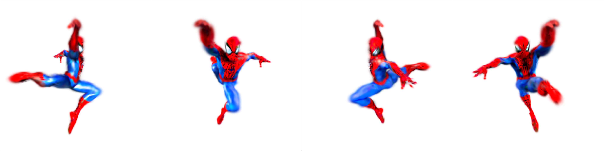
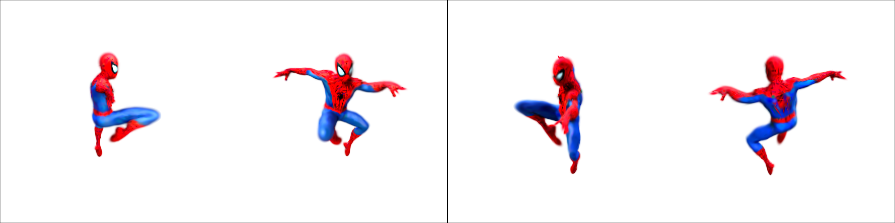
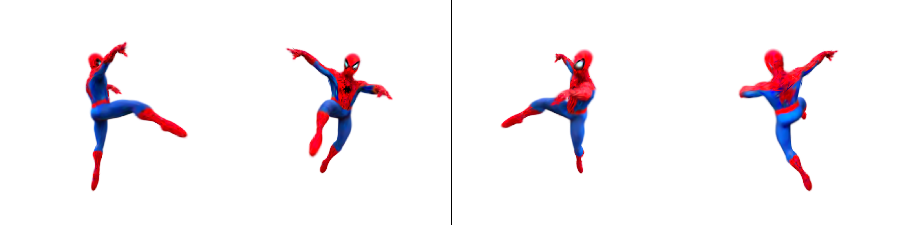
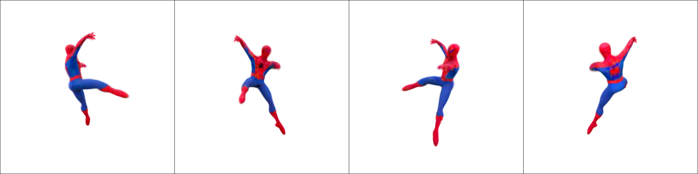

# Coupled Score Distillation: Unlocking Geometrically Consistent Text-to-3D Generation with Multi-View Constraints and Gaussian Splatting

## Quantitative Results

Based on the quantitative experiments supplemented by DreamControl [1], we evaluated geometry and text consistency using the occurrence rate of the Janus problem (JR) and CLIP-Score (CS) [2] on 30 text prompts, respectively.

[1] DreamControl: Control-based text-to-3D generation with 3D self-prior. CVPR, 2024.
[2] CLIPScore: A reference-free evaluation metric for image captioning. arXiv:2104.08718, 2021.

| Method                | JR(%)↓ | CS(%)↑ |
|-----------------------|-------|-------|
| DreamFusion-IF*       | 36.67 | 26.36 |
| Magic3D*              | 53.33 | 26.59 |
| ProlificDreamer*      | 56.67 | 26.69 |
| Zero-1-to-3           | 16.67 | 21.25 |
| MVDream*              | 10    | 26.17 |
| DreamControl*         | 10    | 28.14 |
| SDI                   | 53.33 | 28.14 |
| GS-SDS                | 56.67 | 29.23 |
| DreamGaussian-sds     | 66.66 | 22.33 |
| DreamGaussian-mvdream | 10    | 22.17 |
| GaussianDreamer       | 26.67 | 29.23 |
| GSGEN                 | 76.67 | 28.31 |
| LucidDreamer          | 33.33 | 27.89 |
| SyncDreamer           | 33.33 | 29.75 |
| LGM                   | 23.33 | 29.42 |
| CSD-3D-GS (Ours)      | 3.33  | 28.98 |
| **CSD-Mesh (Ours)**   | **3.33**  | **30.23** |

## Quantitative results showcase

Video results of the proposed CSD based on 30 text prompts.

See [Project Page](https://showresults.github.io/CSD/) for more details.

## Qualitative results showcase

Video of additional qualitative comparison results.

See [Project Page](https://showresults.github.io/CSD/) for more details.

## Impact of $\lambda$ in the proposed CSD

Four orthogonal perspective images.

_Text prompts: A DSLR photo of a Spiderman dancing, Marvel character, highly detailed 3D model._

| $\lambda$ | Image |
|----------|-------|
| 0.1      |  |
| 0.5      |  |
| 1.0      |  |
| 2.0      |  |
